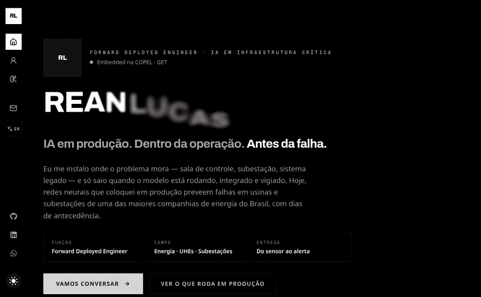

# Rean Lucas — Redes Neurais em Produção

Portfólio pessoal de um engenheiro de machine learning que coloca deep learning para vigiar ativos críticos do setor elétrico — usinas hidrelétricas e subestações — do sensor ao modelo, do modelo ao pixel.

**Ao vivo:** [portfolio-lovat-gamma-35.vercel.app](https://portfolio-lovat-gamma-35.vercel.app/)

## O que tem aqui

Não é só uma lista de skills — o site demonstra, com dados e animações, o tipo de sistema que eu construo:

- **Sunburst 3D interativo de risco de ativos** — hierarquia empresa → ativo → tag; clique numa tag e veja a predição do modelo contra o valor real do sensor, com o desvio calculado na hora.
- **Predição × real** — gráficos com envelope de normalidade aprendido por redes neurais (RNN/LSTM, CNN, autoencoders), destacando os pontos onde o sensor foge do previsto.
- **Ensemble de detecção** — a anomalia só vira alerta quando ML clássico (Random Forest, KNN) concorda com o deep learning: consenso antes de acordar alguém.
- **Agente de IA de ponta a ponta** — replay animado de um incidente: a tag desvia, o risco cresce no 3D, o agente investiga e dispara o alerta com contexto via WhatsApp e e-mail.
- **Rede neural 3D no hero** — pulsando como neurônios de verdade, 100% monocromática, porque o tema é preto executivo.

## Stack

| Camada | Tecnologias |
| --- | --- |
| Site | Next.js (App Router) · React · TypeScript · Tailwind CSS 4 |
| Animações | Motion (scroll-driven) · react-three-fiber · three.js |
| O que eu faço no trabalho | PyTorch · Transformers · CNNs · Random Forest · KNN · GCP + AlloyDB · Terraform · Vertex AI · LLMs open source |

## Estrutura

- `/` — apresentação, demo interativa de risco, skills, projetos e contato
- `/sobre` — trajetória com vinhetas animadas por era + exemplos práticos
- `/projetos` — case completo da Plataforma de Gestão de Ativos e Riscos e do Agente de IA & LLMs

---

Feito por [Rean Lucas](https://www.linkedin.com/in/rean-lucas-415aa2365/) · dados dos demos são ilustrativos (empresa fictícia ENERGIA S.A.)
